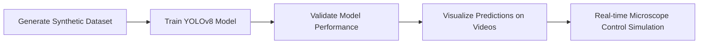

# YOLO Particle Tracking Simulation

This repository generates synthetic microscopy images and videos of particles near irregular membranes and trains a YOLOv8 model to detect and classify them in real time.

---

## Workflow Overview

Features
Synthetic dataset generation: Images with particles dif# YOLO Particle Tracking Simulation

This repository generates synthetic microscopy images and videos of particles near irregular membranes and trains a YOLOv8 model to detect and classify them in real time.

---

## Workflow Overview

Features
Synthetic dataset generation: Images with particles diffusing near irregular cell membranes.
Video generation: Movies showing particle dynamics with realistic astigmatic PSFs and camera noise.
YOLOv8 training: Detects particles as either near the membrane (Ne) or far from the membrane (Fa).
Visualization: Annotates videos using trained YOLOv8 weights.
Reproducible workflow: All steps can be run locally or in Google Colab.
Setup

Install dependencies:

pip install ultralytics noise numpy opencv-python matplotlib scipy imageio
Dataset Generation
Generates synthetic microscopy images of particles near irregular membranes.
Implements XY/Z diffusion and membrane repulsion (anti-jitter) for realistic particle motion.
Generates YOLOv8 labels automatically (Ne vs Fa).
Includes Poisson camera noise and Gaussian smoothing to simulate realistic imaging conditions.
Example Code
from ultralytics import YOLO
import numpy as np
# Load or generate dataset as shown in dataset scripts

Dataset folder structure:

dataset/
├── images/
│   ├── train/
│   └── val/
├── labels/
│   ├── train/
│   └── val/
└── dataset.yaml
YOLOv8 Training
Model: YOLOv8n (73 layers, 3M parameters, 8.1 GFLOPs)
Classes:
0: Fa (far from membrane)
1: Ne (near membrane)
Training on synthetic dataset with epochs=100, batch=16, image size=512.
Saves weights every 5 epochs in runs/run1/weights/.
from ultralytics import YOLO

model = YOLO("yolov8n.pt")
model.train(
    data="dataset/dataset.yaml",
    epochs=100,
    batch=16,
    imgsz=512,
    save_period=5,
    project="runs",
    name="run1",
    device=0
)
YOLOv8 Results

Evaluation on 98 validation images (1,470 particle instances):

Class	Precision	Recall	mAP50	mAP50-95
Fa	0.993	0.884	0.925	0.902
Ne	0.989	0.990	0.995	0.987
All	0.991	0.937	0.960	0.944

Interpretation:

Near-membrane particles (Ne), critical for tracking interactions, are detected almost perfectly.
Far particles (Fa) are detected with slightly lower recall due to edge effects and diffusion near frame borders.
Overall, the model achieves high precision and recall across both classes, suitable for real-time microscope control.

💡 Note: Metrics are calculated on a small validation set; performance can be improved with larger datasets and enhanced PSF handling at image edges.

Video Generation and Visualization
Generates synthetic videos of particle motion with astigmatic PSFs and camera noise.
Uses trained YOLOv8 weights to annotate particles in videos.
Provides realtime display and saves annotated videos for analysis.
Example Video Annotation Code
from ultralytics import YOLO
import cv2
import torch
from IPython.display import display, clear_output
import PIL.Image

model = YOLO("runs/run1/weights/epoch55.pt")
cap = cv2.VideoCapture("test.mp4")
out = cv2.VideoWriter("annotated_video.mp4", cv2.VideoWriter_fourcc(*'mp4v'), 20, (512,512))

for _ in range(int(cap.get(cv2.CAP_PROP_FRAME_COUNT))):
    ret, frame = cap.read()
    if not ret: break
    results = model(frame, device=0, conf=0.25)
    annotated = results[0].plot(conf=False, line_width=1, font_size=0.6)
    out.write(cv2.cvtColor(annotated, cv2.COLOR_RGB2BGR))
References
Ultralytics YOLOv8 Documentation
Synthetic particle tracking literature on microscopy simulations.
Astigmatic PSF modeling for particle detection.
License

MIT License.fusing near irregular cell membranes.
Video generation: Movies showing particle dynamics with realistic astigmatic PSFs and camera noise.
YOLOv8 training: Detects particles as either near the membrane (Ne) or far from the membrane (Fa).
Visualization: Annotates videos using trained YOLOv8 weights.
Reproducible workflow: All steps can be run locally or in Google Colab.

Setup

Install dependencies:
pip install ultralytics noise numpy opencv-python matplotlib scipy imageio
